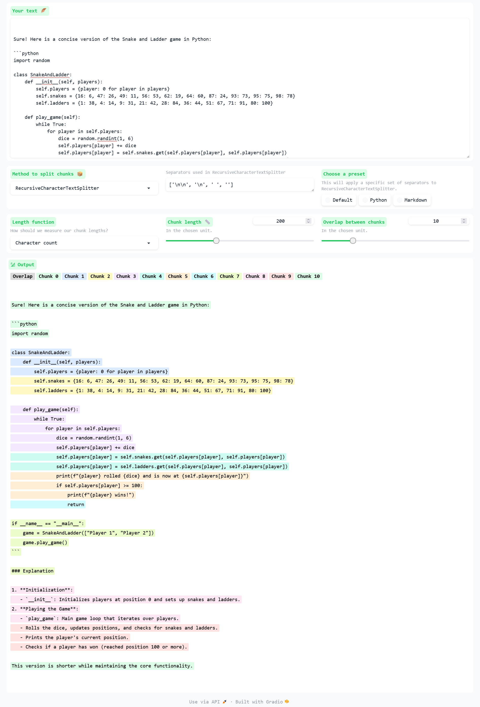
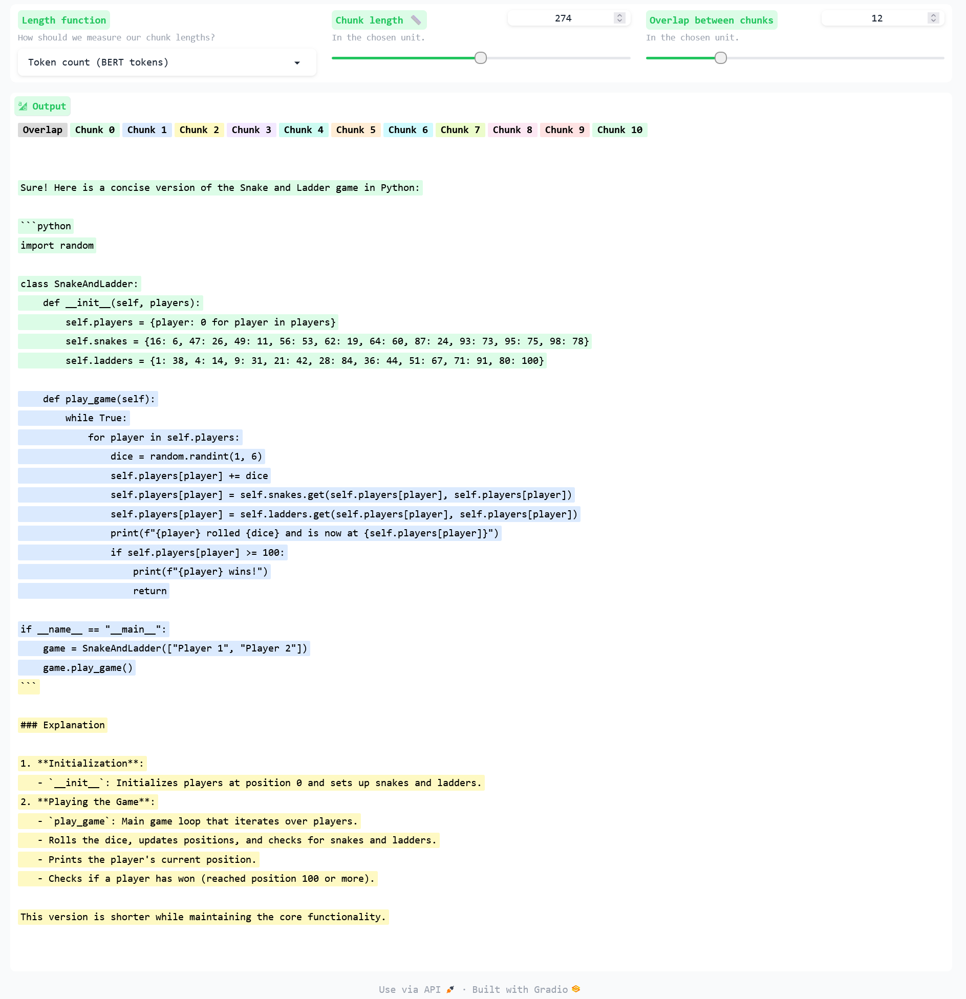

## MODEL: BETELGEUSE BERT BASED UNCASED🔣

⬇️Download the Model Form : https://huggingface.co/prithivMLmods/Betelgeuse-bert-base-uncased

🚀Check out the configuration reference at : https://huggingface.co/docs/hub/spaces-config-reference

🚀Huggingface space : https://huggingface.co/spaces/prithivMLmods/BERT-UNCASED

🚀The GitHub Model Workspace : git clone https://huggingface.co/spaces/prithivMLmods/BERT-UNCASED

ℹ️Generated Result in Huggingface Spaces:

## 🔮The text input to chunk

## 🪶Bert Classified Result Uncased 

.

.

.

.
